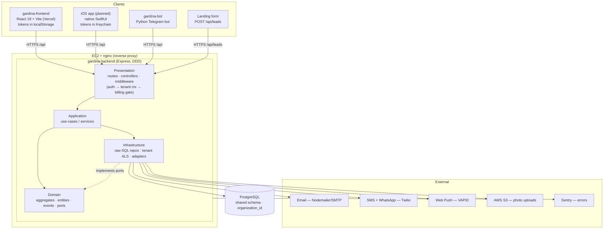

# Gardina — System Architecture

Gardina is a **multi-tenant SaaS ERP for curtain / drapery salons**. One backend and one
database serve every salon (tenant); each tenant's data is isolated by `organization_id`.

- **Backend**: `gardina-backend` — Express 4, Node (ESM), PostgreSQL via `pg`, raw SQL,
  Domain-Driven Design layering. Entry: `gardina-backend/src/server.js`.
- **Frontend**: `gardina-frontend` — React 19 + Vite, axios, tokens in `localStorage`.
- **Bot**: `gardina-bot` — Python Telegram bot (aiogram-style handlers/keyboards/states),
  its own thin client over the same database / business domain.

**API base path: `/api`** (no `/v1` prefix).
- prod: `https://api.gardina.kz/api`
- dev:  `http://localhost:5000/api`

The full HTTP contract lives in [`openapi.yaml`](./openapi.yaml).

---

## 1. Monorepo layout

```
gardina/
├── gardina-backend/      # Express + PostgreSQL API (DDD)
│   └── src/
│       ├── server.js              # composition root: app, middleware, route mounts
│       ├── domain/                # enterprise business rules (no framework deps)
│       │   ├── aggregates/        # Deal aggregate, etc.
│       │   ├── entities/
│       │   ├── value-objects/
│       │   ├── events/            # domain events (deal_events)
│       │   ├── repositories/      # repository interfaces (ports)
│       │   └── services/          # domain services
│       ├── application/           # use-cases / orchestration
│       │   ├── use-cases/
│       │   └── services/
│       ├── infrastructure/        # adapters: DB, external services, tenant context
│       │   ├── database/          # pg pool, migrations
│       │   ├── repositories/      # raw-SQL repository implementations
│       │   ├── services/          # Email, SMS, Push, S3, Sentry adapters
│       │   ├── templates/         # email/message templates
│       │   └── tenant/            # AsyncLocalStorage tenant context
│       └── presentation/
│           └── http/
│               ├── routes/        # Express routers (auth, orders, deals, …)
│               ├── controllers/   # request → use-case → response
│               └── middleware/    # auth.middleware, billing.middleware, …
├── gardina-frontend/     # React 19 + Vite SPA
├── gardina-bot/          # Python Telegram bot
├── gardina-screens/      # screen specs / design references
├── nginx/                # reverse-proxy config
├── docs/                 # this documentation set + openapi.yaml
└── docker-compose.yml    # local full-stack orchestration
```

---

## 2. Backend DDD layers

Dependencies point **inward only**: presentation → application → domain; infrastructure
implements domain ports.

| Layer | Responsibility | Depends on |
|-------|----------------|------------|
| **Domain** | Pure business rules, aggregates (e.g. the `Deal` aggregate and its lifecycle), value objects, domain events, repository **interfaces**. No Express, no SQL. | nothing |
| **Application** | Use-cases that orchestrate domain objects and repositories; transaction boundaries; application services. | domain |
| **Infrastructure** | Concrete adapters: PostgreSQL pool + **raw-SQL repository implementations**, Email/SMS/Push/S3/Sentry services, the AsyncLocalStorage **tenant context**. | domain (implements its ports) |
| **Presentation (HTTP)** | Express routers → controllers → middleware. Translates HTTP ↔ application use-cases. | application |

Why raw SQL (not an ORM): see [`adr/0001-postgres-raw-sql.md`](./adr/0001-postgres-raw-sql.md).

---

## 3. Multi-tenant isolation (AsyncLocalStorage)

Every business table carries an `organization_id`. Tenant scoping is enforced at request
scope, not passed manually through every function call.

- `src/infrastructure/tenant/tenantContext.js` exports a Node `AsyncLocalStorage`
  instance (`tenantStorage`) plus `getTenantId()`.
- The **auth middleware** loads the authenticated user from the DB, then binds
  `{ organizationId }` into the store for the lifetime of the request.
- Repositories call `getTenantId()` and inject `organization_id` into every query's
  `WHERE` clause. `getTenantId()` **throws** if the context was never initialized — a
  query can never silently run cross-tenant.

This is a shared-schema, single-database design. Rationale and trade-offs:
[`adr/0003-multitenant-shared-schema.md`](./adr/0003-multitenant-shared-schema.md).

---

## 4. Request lifecycle

```
HTTP request
  │
  ▼
CORS / JSON body parsing / request logging
  │
  ▼
Auth middleware  ─ verify JWT Bearer (access token)
  │              ─ check in-memory logout blacklist
  │              ─ load user from DB
  │              ─ bind tenant context (AsyncLocalStorage: organizationId)
  ▼
authorize(...roles)        ─ role gate → 403 if role not allowed
  │
  ▼
Billing read-only check    ─ on writes (POST/PUT/PATCH/DELETE), if subscription is
  │                          expired / past_due / canceled → 402 {code: SUBSCRIPTION_READ_ONLY}
  │                          (/auth and /billing are whitelisted)
  ▼
Controller                 ─ validate input, call application use-case
  │
  ▼
Use-case → Domain + Repository (raw SQL, tenant-scoped via getTenantId())
  │
  ▼
PostgreSQL
  │
  ▼
Response (JSON)   ─ success: {data: …}; errors: {error|code, message}
```

Public exceptions (no Bearer): `POST /auth/register-salon` (3/h rate-limited),
`POST /auth/login`, `POST /auth/refresh-token`, password-reset endpoints,
`GET /auth/check-slug`, `GET /auth/verify-email`, `GET /notifications/push/vapid-key`,
`POST /leads`, and the health endpoint `GET /health`.

> Note: only `GET /health` (DB ping → `healthy`/`unhealthy`) is implemented in
> `server.js`. There are currently **no** `/ready` or `/version` routes; `GET /api`
> returns a small service-info JSON.

Auth details (issuance, refresh, blacklist, roles, 402 gate):
[`AUTH.md`](./AUTH.md).

---

## 5. Deployment

Both halves **auto-deploy from `main`**.

| Component | Host | Pipeline |
|-----------|------|----------|
| Frontend (`gardina-frontend`) | **Vercel** | Push to `main` → Vercel build + deploy. |
| Backend (`gardina-backend`) | **AWS EC2** | Push to `main` → CI builds backend image (`--no-cache --pull`), `npm ci`, deploys to EC2. nginx (`nginx/`) reverse-proxies to the Node process. |
| Database | PostgreSQL | Single shared instance; migrations in `src/infrastructure/database`. |

External integrations and their env vars: [`DEPENDENCIES.md`](./DEPENDENCIES.md).

---

## 6. What iOS reuses

The planned iOS app is a **native client only**. Everything server-side is reused unchanged:

| Reused as-is | Detail |
|--------------|--------|
| **Backend API** | Same Express app, same `/api` base path, same routes. No iOS-specific endpoints. |
| **Database & business logic** | Domain rules, deal lifecycle, tenant isolation, billing gating all live server-side. iOS never reimplements them. |
| **OpenAPI contract** | [`openapi.yaml`](./openapi.yaml) is the single source of truth. iOS generates / hand-writes its client from it. |
| **Auth** | Same JWT Bearer flow (access 7d / refresh 30d), same `/auth/*` endpoints. iOS only changes **where** tokens are stored → Keychain (see [`AUTH.md`](./AUTH.md)). |
| **Multi-tenancy & RBAC** | Enforced server-side; iOS just sends the Bearer token. |

iOS **adds only**: a native SwiftUI client (UI, navigation, local caching) and — later —
APNs instead of Web Push for notifications. Rationale for native SwiftUI:
[`adr/0004-native-swiftui-ios-client.md`](./adr/0004-native-swiftui-ios-client.md).

---

## 7. Component diagram


