# Gardina — Entity-Relationship Model

Shared-schema multi-tenant design: every business table belongs to one `organizations`
row via `organization_id`. The diagram shows the core entities and their relationships;
attribute lists are representative (not exhaustive — see migrations for full columns).

## ER diagram

```mermaid
erDiagram
  organizations  ||--o{ users              : "has"
  organizations  ||--o{ clients            : "has"
  organizations  ||--o{ deals              : "has"
  organizations  ||--o{ measurements       : "has"
  organizations  ||--o{ proposals          : "has"
  organizations  ||--o{ fabrics            : "has"
  organizations  ||--o{ service_rates      : "has"
  organizations  ||--o{ orders             : "has"
  organizations  ||--o{ installations      : "has"
  organizations  ||--o{ payments           : "has"
  organizations  ||--o{ notifications      : "has"
  organizations  ||--o{ audit_logs         : "has"
  organizations  }o--|| subscription_plans : "current_plan"

  clients        ||--o{ measurements       : "requests"
  clients        ||--o{ deals              : "has"

  measurements   ||--o{ measurement_windows: "contains"

  deals          ||--|| measurements       : "for"
  deals          ||--|| proposals          : "has"
  deals          ||--o{ deal_events        : "logs"
  deals          ||--o{ orders             : "produces"
  deals          ||--o{ installations      : "schedules"
  deals          ||--o{ payments           : "receives"

  fabrics        ||--o{ product_variants   : "has"

  users          ||--o{ push_subscriptions : "owns"
  users          ||--o{ chat_messages      : "sends"
  users          ||--o{ notifications      : "receives"

  organizations {
    uuid   id PK
    string name
    string slug
    string current_plan_code FK
    enum   subscription_status "active|trial|past_due|pending_payment|canceled"
    timestamp trial_ends_at
  }
  users {
    uuid id PK
    uuid organization_id FK
    string email
    string password_hash "bcrypt"
    enum   role "user_role"
    bool   email_verified
  }
  clients {
    uuid id PK
    uuid organization_id FK
    string name
    string phone
    string source
  }
  measurements {
    uuid id PK
    uuid organization_id FK
    uuid client_id FK
    enum status "measurement_status"
    timestamp scheduled_at
  }
  measurement_windows {
    uuid id PK
    uuid measurement_id FK
    int  width_mm
    int  height_mm
    enum mounting_type "wall|ceiling|frame|niche"
  }
  deals {
    uuid id PK
    uuid organization_id FK
    uuid client_id FK
    uuid measurement_id FK
    uuid proposal_id FK
    enum status "deal_status"
    numeric total_amount
  }
  deal_events {
    uuid id PK
    uuid deal_id FK
    string event_type
    jsonb payload
    timestamp created_at
  }
  proposals {
    uuid id PK
    uuid organization_id FK
    uuid deal_id FK
    enum status "proposal_status"
    numeric amount
  }
  fabrics {
    uuid id PK
    uuid organization_id FK
    string name
    string code
    enum fabric_type "transparent|semi_blackout|blackout|decorative"
  }
  product_variants {
    uuid id PK
    uuid fabric_id FK
    string sku
    numeric price
    bool is_default
  }
  service_rates {
    uuid id PK
    uuid organization_id FK
    string service_code
    numeric rate
  }
  orders {
    uuid id PK
    uuid organization_id FK
    uuid deal_id FK
    enum status "order_status"
  }
  installations {
    uuid id PK
    uuid organization_id FK
    uuid deal_id FK
    enum status "installation_status"
    timestamp scheduled_at
  }
  payments {
    uuid id PK
    uuid organization_id FK
    uuid deal_id FK
    enum status "payment_status"
    numeric amount
  }
  notifications {
    uuid id PK
    uuid organization_id FK
    uuid user_id FK
    enum type "notification_type"
    bool is_read
  }
  push_subscriptions {
    uuid id PK
    uuid user_id FK
    string endpoint
    string p256dh
    string auth
  }
  subscription_plans {
    string code PK "start|pro|network"
    string name
    numeric price
  }
  audit_logs {
    uuid id PK
    uuid organization_id FK
    uuid actor_user_id FK
    string action
    jsonb diff
  }
  chat_messages {
    uuid id PK
    uuid organization_id FK
    uuid user_id FK
    text body
  }
```

## Cardinality summary

- `organizations` 1—* `users`, `clients`, `deals`, `measurements`, `proposals`,
  `fabrics`, `service_rates`, `orders`, `installations`, `payments`, `notifications`,
  `audit_logs`, `chat_messages`.
- `organizations` *—1 `subscription_plans` (`current_plan_code`).
- `clients` 1—* `measurements`, `deals`.
- `measurements` 1—* `measurement_windows`.
- `deals` (aggregate root) 1—1 `measurements`, 1—1 `proposals`; 1—* `deal_events`,
  `orders`, `installations`, `payments`.
- `fabrics` (products) 1—* `product_variants`.
- `users` 1—* `push_subscriptions`, `chat_messages`, `notifications`.

---

## Enums (PostgreSQL types)

| Enum | Values |
|------|--------|
| `user_role` | `designer`, `manager`, `production`, `installer`, `admin`, `sales` |
| `deal_status` | `lead`, `measurement_scheduled`, `measurement_done`, `proposal_sent`, `proposal_accepted`, `contract_signed`, `in_production`, `ready_for_installation`, `installation_scheduled`, `installed`, `completed`, `cancelled` |
| `order_status` | `pending`, `cutting`, `sewing`, `quality_check`, `ready`, `shipped` |
| `measurement_status` | `scheduled`, `in_progress`, `completed`, `cancelled` |
| `proposal_status` | `draft`, `sent`, `viewed`, `accepted`, `rejected` |
| `payment_status` | `pending`, `partial`, `paid`, `refunded` |
| `installation_status` | `scheduled`, `in_progress`, `completed`, `rescheduled`, `cancelled` |
| `fabric_type` | `transparent`, `semi_blackout`, `blackout`, `decorative` |
| `mounting_type` | `wall`, `ceiling`, `frame`, `niche` |
| `notification_type` | `urgent`, `warning`, `info` |
| `subscription_status` (organizations) | `active`, `trial`, `past_due`, `pending_payment`, `canceled` |
| subscription plan codes (`subscription_plans.code`) | `start`, `pro`, `network` |

> `measurement_windows` dimensions are stored in **millimetres**.
